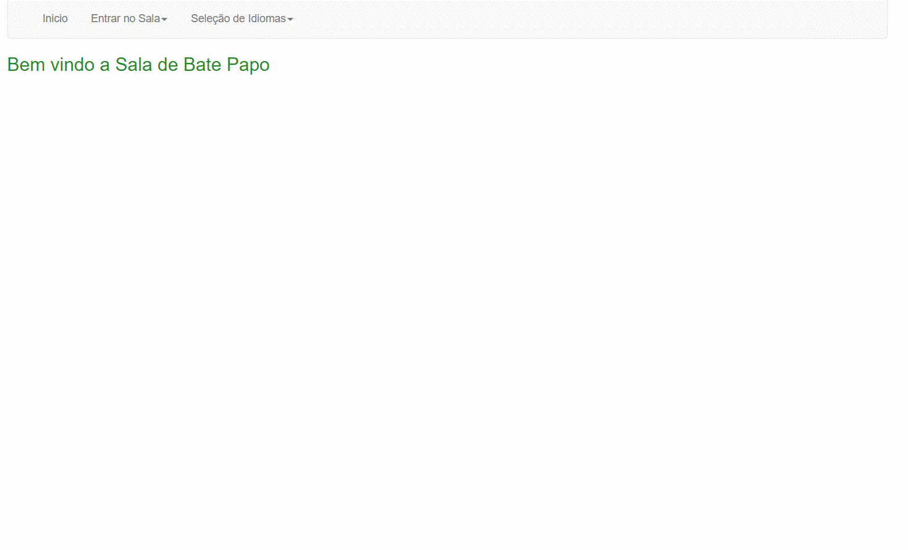

<h1 align="center">
  Sistema de Bate Papo
</h1>

## 💻 Detalhes do projeto

O sistema foi desenvolvido durante um trabalho da faculdade no ano de 2018, na aula de Tópicos Avançados feito em parceria com o [renatoanunciacao](https://github.com/renatoanunciacao). O projeto que tem por objetivo disponibilizar um sistema onde seja possível ter um modelo de 
chat online, com entrada e saida de multiplos usuários com envio de mensagens entre eles.
<h1 align="center">
    
</h1>

## :grey_question: Sobre esse projeto

Feito com objetivo de aprimorar as habilidades de interpretação e resoluções de problemas conforme solicitado na elaboração do projeto. A ideia é permitir os usuários cadastrarem
um nome único no chat, enviar mensagens para todos de forma pública, permitir entrada e saída dos usuários mostrando notificações, visualizar todos os usuários da sala, internacionalização de mensagens
e usar as tecnologias EJB (Enterprise Java Beans) e JSF (Java Server Faces). 
*Funciona corretamente apenas no servidor glassfish.
## :rocket: Tecnologias utilizadas no projeto

As tecnologias utilizadas no projeto foram:

- [Java 8](https://www.oracle.com/br/java/technologies/javase/javase8-archive-downloads.html)
- [PostgreSQL](https://jdbc.postgresql.org/changelogs/2017-08-01-42.1.4-release/)
- [Hibernate Validator](https://hibernate.org/orm/releases/4.2/)
- [Hibernate JPA](https://mvnrepository.com/artifact/org.hibernate.javax.persistence/hibernate-jpa-2.0-api)
- [Jasper Records](https://sourceforge.net/projects/jasperreports/)
- [All Themes](https://mvnrepository.com/artifact/org.primefaces.themes/all-themes/1.0.10)
- [Primefaces](https://www.primefaces.org/primefaces-6-1-final-released/)
- [JavaServer Faces](http://www.java2s.com/example/jar/j/download-javaxfaces2214jar-file.html)
- [Glash Fish 4.0]([https://tomcat.apache.org/download-90.cgi](https://download.oracle.com/glassfish/4.0/release/index.html))

## :package: Como utilizar o projeto

É preciso ter instalado no computador o [Git](https://git-scm.com) e o [Node.js](https://nodejs.org/) para clonar e executar o projeto. 
O projeto pode ser baixado com as linhas de comando ou no formato zip clicando no botão "Code" na opção "Download ZIP"

```bash

    # Clonar os repositórios
    $ https://github.com/alexvieirasj/BatePapo

    # Todas as bibliotecas estão adicionados no projeto dentro da pasta lib

    # Abrir o projeto executar via Netbeans, Intelij ou Eclipse
    
    # running on port 8080
```

## :memo: Licença

Este projeto está sob a MIT License. Acesso o arquivo [LICENSE](https://github.com/alexvieirasj/BatePapo/blob/master/LICENSE) para maiores detalhes.

